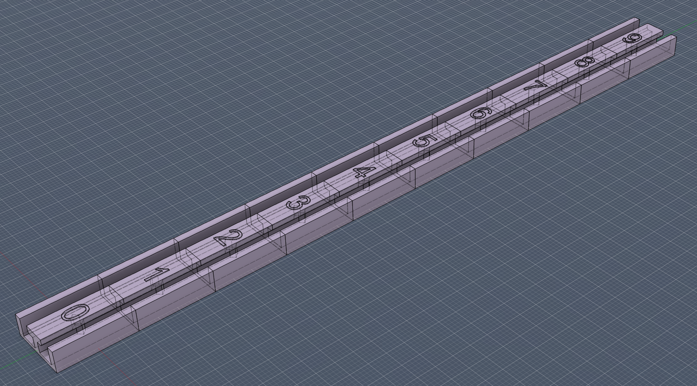

# PatternedCount – Automatic Numbering for Patterned Counter Segments

**PatternedCount** is a Fusion 360 add-in that automatically generates correctly spaced and styled numbering for sliding counters, dial indicators, deck-box life counters, and other patterned components. Intended for use with multi color 3d prints.

The add-in reads your user parameters and a single template Sketch Text entity, then creates the full numbered sequence by duplicating, positioning, and formatting text for each segment. Existing number graphics are deleted and regenerated cleanly every time you run the add-in.

This is ideal for multi-material 3D printed projects where each digit needs its own cutout and body.

## Features

- Uses **one master Sketch Text** as a styling and alignment template
- Generates a complete sequence of numbers (e.g., `0–9`, `1–10`, padded forms)
- Places each number at `i * pcSegmentPitch` relative to the template
- Respects the template’s font, size, rotation, alignment, position relative to geometry
- Automatically deletes previously generated digits
- Fully parameter-driven — **no GUI**, no prompts
- Can cut and create new bodies using `pcCutDepth`
- Names all created bodies with numbers (`n0` for example)

## User Parameters

Create these parameters in **Modify → Change Parameters**.

**Important:** Integer parameters must be created as **unitless** (leave the Unit field blank or select "No Unit"). Using a text parameter or adding units will cause errors.

### Required Parameters

| Name             | Type           | Description                                               |
| ---------------- | -------------- | --------------------------------------------------------- |
| `pcSegmentCount` | Unitless (int) | Number of segments (e.g., `10` for digits 0–9).           |
| `pcSegmentPitch` | Length         | Center-to-center spacing between segments (e.g., `6 mm`). |
| `pcStartNumber`  | Unitless (int) | First number in the sequence (e.g., `0`).                 |

### Optional Parameters

| Name          | Type   | Description                                                           |
| ------------- | ------ | --------------------------------------------------------------------- |
| `pcDirection` | Text   | Direction to place numbers: `+X` (default), `-X`, `+Y`, or `-Y`.      |
| `pcCutDepth`  | Length | If set, creates cuts and new bodies for each number (e.g., `0.4 mm`). |

## Usage

1. Create a sketch on the ~face~ where you want the numbers.
2. Add **one Sketch Text** item (the template) positioned exactly where the first digit belongs.
   - Style it however you like (font, bold, alignment, etc.).
   - This single item is the _reference_ for all generated digits.
3. Set up your parameters (`pcSegmentCount`, `pcSegmentPitch`, `pcStartNumber`, etc.).
4. Select the sketch in the browser (or edit it).
5. Run **PatternedCount** from **Scripts and Add-Ins** (`Shift+S`).
6. The add-in will:
   - Update your template text to show `pcStartNumber`
   - Delete all previously generated texts (only those created by the add-in)
   - Create new digits for all remaining segments
   - Optionally create cuts and bodies if `pcCutDepth` is set
7. Your existing extrude features will update automatically.

Whenever you change parameters, simply run **PatternedCount** again.

## Notes

- The add-in does _not_ run automatically when parameters change (Fusion 360 limitation).  
  You must run it manually after adjusting parameters.
