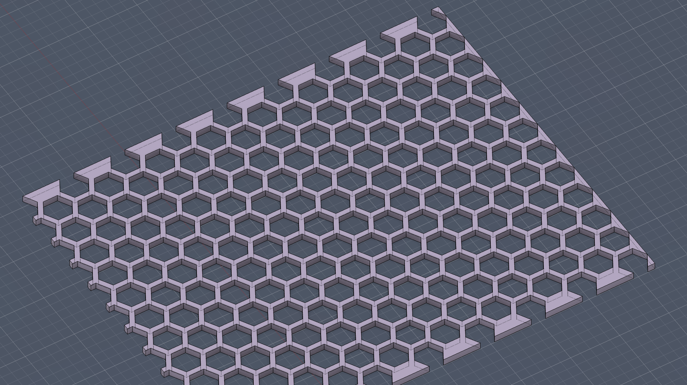

# Andli's Fusion Add-ins

A collection of parameter-driven Fusion 360 scripts for common design patterns. No GUI dialogs—just set your parameters and run.

## Add-ins

### PatternedCount

Automatically generates numbered text sequences for sliding counters, dial indicators, and other patterned components. Ideal for multi-material 3D printing.

[View PatternedCount documentation](PatternedCount/README.md)

### HexPattern

Creates a honeycomb pattern of hexagonal cuts on a selected face. Great for ventilation grilles, decorative panels, or lightweight structures.

[View HexPattern documentation](HexPattern/README.md)

## Installation

1. Download or clone this repository
2. In Fusion 360, go to **Utilities → Add-Ins → Scripts and Add-Ins** (or press `Shift+S`)
3. Click the green **+** button next to "My Scripts"
4. Navigate to the add-in folder you want to install (e.g., `PatternedCount` or `HexPattern`)
5. Select the folder and click **Open**

Repeat for each add-in you want to use.

## Usage

All add-ins follow the same workflow:

1. Set up user parameters in **Modify → Change Parameters**
2. Select the appropriate geometry (sketch, face, etc.)
3. Run the script from **Scripts and Add-Ins** (`Shift+S`)

See individual add-in READMEs for specific parameters and usage.

## License

MIT License - see [LICENSE](LICENSE) for details.
